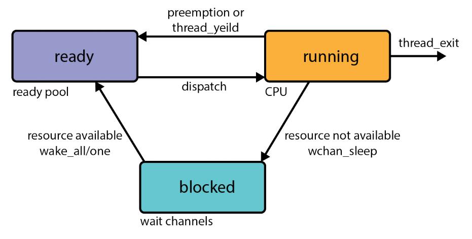

# CS350 review notes and code samples

## About

This repo was created to collect and share important Operating System concepts from the cs350 course offered at the University of Waterloo :mortar_board:. Feel free to contribute anything else!

## Study Topics

### [Unit 1: Threads](https://www.student.cs.uwaterloo.ca/~cs350/F19/notes/threads-1up.pdf)

#### What is a Thread?

* A thread is *a sequence of instructions.* They provide a way for programmers to express concurrency. All threads **share** access to the program's global variables and heap, but each thread's stack frames are **private**. A thread can:
  * Create new threads
  * Terminate itself
  * Yield execution to another (unspecified) thread.
* 5 reasons why use threads?
  * Resource Utilization - blocked threads can give up CPU resources
  * Parallelism
  * Responsiveness - a thread only for UI
  * Priority - allocate CPU time differently
  * Modularization - organization of tasks

**Recall**: Sequential programs follow the *Fetch/Execute Cycle*, where instruction \#`PC` is fetched, decoded, and executed, and then `PC` is incremented.

**Recall**: The stack starts at address `0xFFFF FFFF` and grows towards `Ox0`.

Conceptually, multiple threads should execute sequentially with their own private register contents and stack.

#### Implementing Concurrent Threads

* 3 ways to implement concurrent threads
  * Hardware Support - `P` processors, `C` cores, `M` multithreading per core means we can have `PCM` simultaneous threads running.
  * Timesharing - multiple threads rapidly switching on the same hardware. Each thread gets a small amount of time to execute, and when that time expires, a context switch occurs.
  * Hardware + Timesharing

**Context Switch**: the switch from one thread to another in timesharing. During a context switch:

  1. decide which thread runs next (scheduling)
  1. save current thread's registers
  1. load register contents of next thread

Context switches are caused by:

* the running thread calling `thread_yield`
* the running thread calling `thread_exit`
* the running thread **blocks** by calling `wchan_sleep`
* the running thread is **preempted** (involuntary switch)

**Preemption** forces a running thread to stop running so another thread can have a chance. To "gain control" (run thread library code without calling a thread lib function), **interrupts** are used. If a thread exceeds the scheduling quantum (time limit), the thread is preempted.

**Interrupts** are an event that occurs during the execution of a program. When an interrupt occurs, the hardware transfers control to a fixed location in memory, to an *interrupt handler*. The interrupt handler:

  1. Creates a trapframe to record thread context
  1. Determines which device caused the interrupt and performs device-specific processing.
  1. Restores the saved thread context from the trap frame and resumes execution of the thread.

In terms of stack frames, it looks like this (Thread 1 and 2, where 1 is running and 2 has **Thread Yield**, **Thread Switch**, and **Switchframe** on its stack):

  1. An interrupt is created (not a stack frame)
  1. Add **Trap Frame** - capture the current state of the thread
  1. Add **Interrupt Handler Stack Frames**
  1. Add **Thread Yield** - exceeded quantum, so yield
  1. Add **Thread Switch** - (high-level context switch) choose a new thread and save caller-save registers
  1. Add **Switchframe** - (low-level context switch) save callee-save registers

Then, switch to the other thread and pop off the **Switchframe**, **Thread Switch**, and **Thread Yield**, and resume execution.

* 3 thread states
  * Running (on CPU)
  * Blocked (on wait channels)
  * Ready (waiting to run on CPU)
* Know how to draw 2 thread stacks with context switches between them

### [Unit 2: Syncronization](https://www.student.cs.uwaterloo.ca/~cs350/F19/notes/synchronization-1up.pdf)

* Define Critical Sections
* Define Race Conditions
* Define Mutual Exclusion and how to achieve
* Define Test-and-Set and atomic operations
* __4 synchronization primitives__
  * __Spinlocks__
  * __Blocking Locks__
  * __Semaphores__
    * __Binary Semaphore__
    * __Counting Semaphore__
    * __Barrier Semaphore__
  * __Condition Variables__
    * What are mesa-style condition variables? How are they different from Hoare style?
* Deadlocks and techniques for prevention
  * __No Hold and Wait__
  * __Resource Ordering__
* Volatile keyword and how it works

### [Unit 3: Processes, Kernel, System Calls](https://www.student.cs.uwaterloo.ca/~cs350/F19/notes/processes-1up.pdf)

* Define Process
* Define Kernel
* Define System Call
* Know how to use basic system calls
  * fork
  * getpid
  * waitpid
  * exit
  * execv
* Define Application Binary Interface (ABI)
* Distinguish between privileged and unprivileged code
* 2 things which make kernel code execute
  * __Interrupts__
  * __Exceptions__
* Define Interrupt Handler
* Define Exception Handler
* Distinguish between user (application) and kernel stack
* __Know how to draw processes and system calls with details regarding user and kernel stack__

### [Unit 4: Virtual Memory](https://www.student.cs.uwaterloo.ca/~cs350/F19/notes/virtualmemory-1up.pdf)

* Define physical memory
* Define virtual memory and why we need it
* Memory structure, internal/external fragmentation
* Understand address translation and 3 ways to do it
  * __Dynamic relocation__
  * __Segmentation__
     * __Relocation Register + Limit register__
     * __Segment table__
  * __Paging__
     * __Single Level paging__
     * __Multi-Level paging__
* Understand the role of MMU in address translation
* Define Translation Lookaside Buffer (TLB)
  * Define __software-managed TLB__
  * Define __hardware-managed TLB__
  * Know about what each of the 64 bits in TLB is used for
* Undestand Virtual Memory implementation in OS/161 and its limitations
* Be able to translate virtual addresses to physical addresses using OS/161 
* Define Executable Linking Format (ELF) files and their role
  * Understand difference between __text segment__ and __data segment__ in OS/161 ELF files
* Undertand how virtual memory partitioned
  * User addresses from 0x0 to 0x7FFFFFFF
  * Kernel addresses from 0x80000000 to 0xFFFFFFFF
    * kseg0 - 0x80000000 to 0xA0000000 - 512mb - for kernel data structures, stacks, etc
    * kseg1 - 0xA0000000 to 0xC0000000 - 512mb - for addressing devices
    * kseg2 - 0xC0000000 to 0xFFFFFFFF - 512mb - unused
  * Know how to translate kernel virtual addresses to physical addresses
* Define __page swapping__ and how it is implemented
  * Define resident set
  * Define present bit
* Know why __page faults__ happen
* Know about __page replacement policies__
  * FIFO
  * Optimal
  * LRU
  * __Clock Replacement*__
* Define __locality__
  * __temporal locality__
  * __spatial locality__

#### [Unit 5: Scheduling](https://www.student.cs.uwaterloo.ca/~cs350/F19/notes/scheduling-1up.pdf)
* Define __Scheduling__ and understand why it's needed
  * Define __response time__
  * Define __turnaround time__
* Understand different scheduling implementations
  * __First come, first serve (FCFC)__
  * __Round Robin__
  * __Shortest Job First__
  * __Shortet Remaining Time First__
  * __Multi-level Feedback Queue (MLFQ)*__ 
  * __Linux Completely Fair Scheduler (CFS)*__
* Know 2 different ways of scheduling on Multi-Core processors
* Define __Scalabilility__
* Define __Cache Affinity__
* Define __Load Balancing__

#### [Unit 6: Devices and I/O](https://www.student.cs.uwaterloo.ca/~cs350/F19/notes/io-1up.pdf)
* Define device
* Define bus
  * Define internal bus
  * Define peripheral
* Define bridge
* Define device register and name 3 types
  * __Status device register__
  * __Command device register__
  * __Data device register__
* Define device driver
* Define polling and how to avoid
* Understand how device drivers can access device registers
  * Small data transfer
    * __Port-mapped I/O__
    * __Memory-mapped I/O__
  * Large data transfer
    * __Program-controlled I/O__
    * __Direct memory access (DMA)*__
* High level understanding of common persistent storage devices
  * Magnetic drums
  * Hard disks
  * SSD
  * Peristant RAM
* Know how to calculate cost of __hard disk I/O__
  * Calculate __seek time__
  * Calculate __rotational latency__
  * Calculate __transfer time__
  * __Request Service time = seek time + rotational latency + transfer time__
* Distinguish between sequential and non-sequential I/O
* Understand different __disk head scheduling__ algorithms
  * __First come first serve (FCFC)__
  * __Shortest Seek Time First (SSTF)__
  * __Elevator Algorithms (SCAN)*__
* Basic knowledge of how SSD's work

#### [Unit 7: File Systems](https://www.student.cs.uwaterloo.ca/~cs350/F19/notes/filesystems-1up.pdf)
* Define file
* Define file system
  * Define logical file system
  * Define virtual file system
  * Define physical file system
 * Understand basic file operations
   * Open
   * Close
   * Read, write, seek
   * Get, set
 * Define directory
 * Define i-number and i-node
 * Define hard link
 * Define mounting
 * Understand implementation of Very Simple File System (VSFS)
 * Define superblock
 * Calculate total space used given file name and inode structure
 * Calculate total number of reads and writes on inodes for file operations
 * Define chaining
 * Define external chaining
 * Understand where problems can arise in file operations and how to be fault tolerant
 * Define journaling file system

#### [Unit 8: Virtual Machines](https://www.student.cs.uwaterloo.ca/~cs350/F19/notes/wrapup-1up.pdf)
* Define virtual machine
* Define hypervisor
  * Define Type 1 Hypervisor
  * Define Type 2 Hypervisor
* Explain how virtual machine differs from regular machine in terms of
  * Privilege
  * Virtual memory
  * Page tables
  * I/O and devices

## Guides
 1. [Pointers](Guides/Pointers.pdf)
 2. [LL and SC](Guides/LLSCMIPS.pdf)
 3. [Context Switch](Guides/Context_Switches_and_Switchframe.pdf)
 4. [Locks](Guides/Lock_Guide.pdf)
 5. [Condition Variable](Guides/Condition_Variable_Guide.pdf)
 6. [Virtual Memory](Guides/Virtual_Memory_Guide.pdf)
 7. [Disk and Devices](Guides/Disk_Guide.pdf)
 8. [File System](Guides/File_System_Guide.pdf)

## In-class Handouts
 1. [Threads](Handouts/Threads/)
 2. [Synchronization](Handouts/Synchronization/)
 3. [Processes](Handouts/Processes/)
 4. [Virtual Memory](Handouts/Virtual%20Memory/)
 5. [File Systems](/Handouts/File%20Systems/)

## Extra Review
* Recent Midterms - See piazza.
* [Past Midterm Exams](https://www.student.cs.uwaterloo.ca/~cs350/common/old-exams/)
* [Review Questions Compiled by W10 Students](https://www.student.cs.uwaterloo.ca/~cs350/common/review-questions/CS350-course-review.pdf)

## Credits

A big thank you to my Professor __Lesley Istead__ for dedicating her time to teaching this epic course and personally setting all her students up for success. I especially appreciate her initiative and effort to stream her lectures to all students this term.
